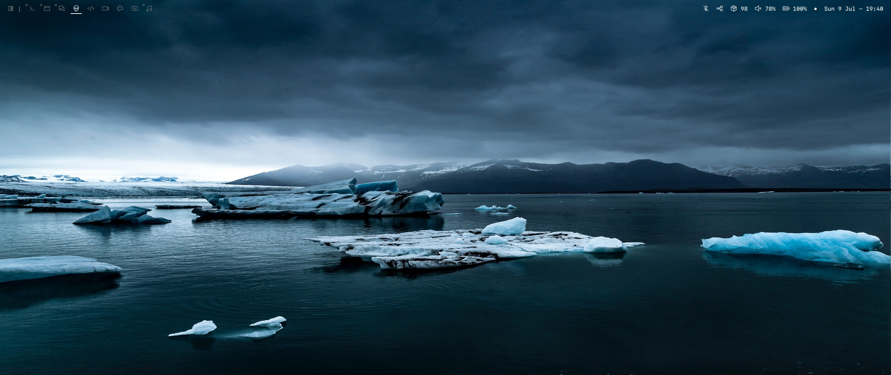
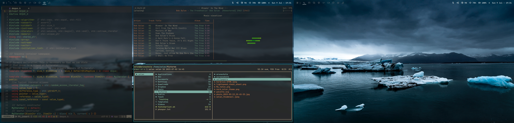
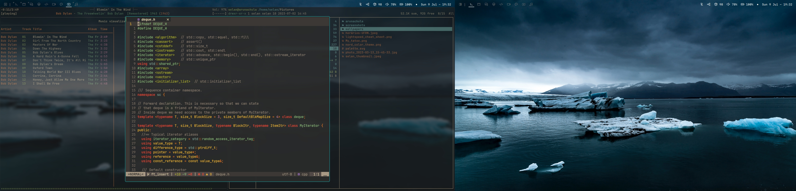

# `dwm` - dynamic window manager

[`dwm`](https://dwm.suckless.org/) is an extremely fast, small, and dynamic window manager for X.

This is my custom build of `dwm` version 6.4 with some patches (in the order they were patched).

1. Patches related to the statusbar behavior.
    - **alpha**: _provides transparency to the statusbar_.
    - **notitle**: _removes the window title from statusbar_.
    - **leftlayout**: _moves the layout indicator to the far left corner_.
    - **statuspadding**: _adds control over the internal padding of the statusbar_.
    - **barpadding**: _adds control over the surrounding padding of the statusbar_.
    - **underlinetags**: _draws a line under the current tag_.
    - **remove-indicator-selected**: _removes the little square of the selected tag, as it already has an underlining bar_.
    - **statusallmons**: _show the statusbar in all monitors_.

2. Pacthes related to the overall behavior of `dwm`.
    - **restartsig**: _supports restarting `dwm` via keybinding_.
    - **pertag**: _supports layout specification per tag_.
    - **full gaps**: _provides easy control of vanity gaps_.
    - **actualfullscreen**: _activates fullscreen mode, rather than the monocle layout_.
    - **attachaside**: _spawns new clients in the stack instead of the master area_.
    - **centeredmaster**: _provides two extra windows layout_.
    - **cyclelayouts**: _allows switching layouts in sequence via keybinding_.
    - **focusdir**: _allows focusing clients to the left/right, bottom/up using vim navigation style_.
    - **push**: _moves the focused client through layout positions._
    - **save floats**: _preserves the geometry of all client windows when activating the float layout_.
    - **focus fullscreen**: _supports cycling through clients in fullscreen mode_.
    - **center**: _defines rules that enable specifying which clients should appear centered and floating_.
    - **toggletag**: _pressing the keybinding to switch to a tag twice brings the view back to the previous tag_.
    - **zoomswap**: _toggling zoom action on/off now places the focused client in the master area and returns it to the same location in the stack area._ 

All patches were downloaded from [https://dwm.suckless.org/patches/](https://dwm.suckless.org/patches/)

Here an screenshot of the final result.

The wallpaper is [here](./pics/emma-francis-unsplash.jpg).
